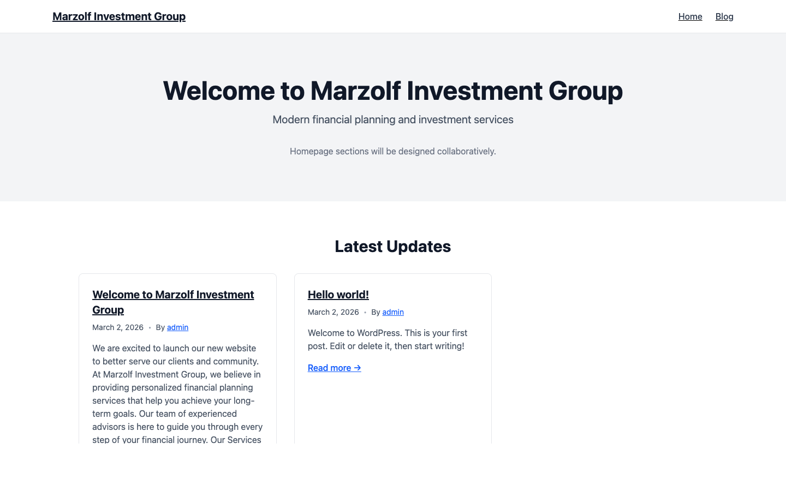

# Marzolf Investment Group

<p align="center">
  
</p>

A modern WordPress website for Marzolf Investment Group, a financial planning firm.

## Overview

Built with the Roots stack (Bedrock + Sage) for modern WordPress development.

## Local Development

**URL**: https://marzolfinvestmentgroup.test

```bash
cd ~/webdev/marzolfinvestmentgroup/web/app/themes/marzolf-theme
npm run dev  # Hot reload
npm run build  # Production build
```

## Design Direction

TBD — design system will be determined collaboratively with client. Currently running neutral base with clean, professional styling.

## Changelog

### 2026-03-02
- Initial site setup with Bedrock + Sage
- Foundation components: header/nav, footer, blog index, single post, comments
- Sample content and navigation
- Ready for collaborative design phase
